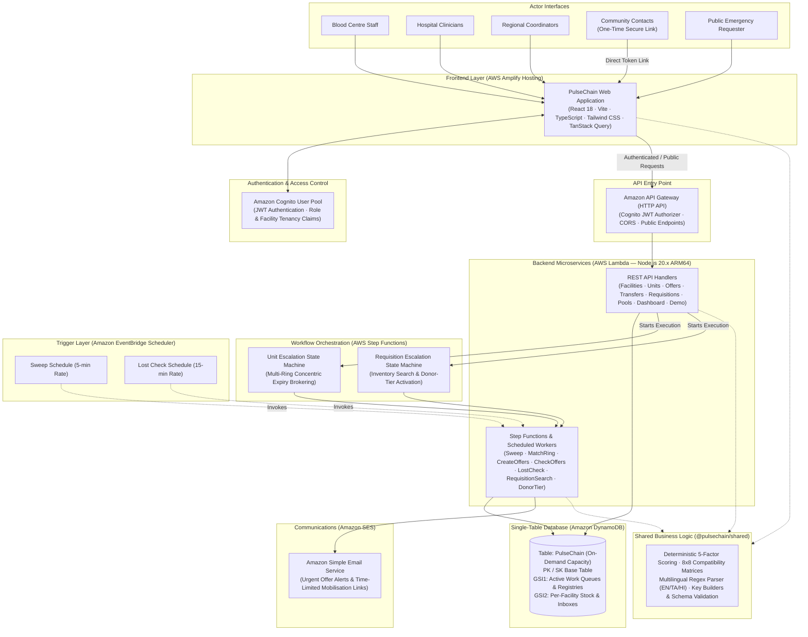
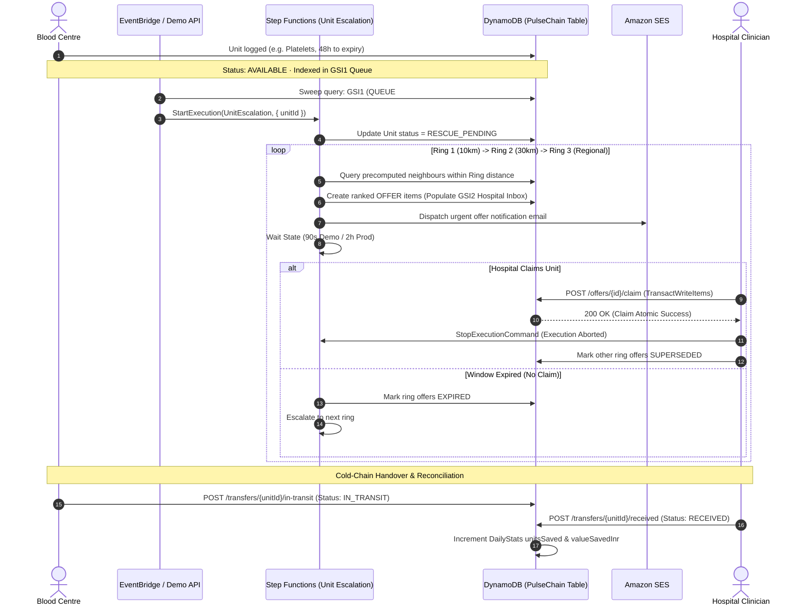

# PulseChain

> **Autonomous Blood & Platelet Supply Coordination Network**  
> A zero-idle-cost, 100% serverless coordination layer connecting blood centres, hospitals, and organized community donor pools across regional healthcare corridors to move available blood components where they are needed while rescuing units approaching expiry.

---

## High-Level Design (HLD)

PulseChain is designed as a dual-directional coordination layer operating on AWS serverless infrastructure. It bridges the gap between institutional blood centres holding units approaching expiry and hospitals facing acute transfusion shortages, backed by a controlled community mobilisation tier when institutional inventory is depleted.

### Conceptual Architecture Diagram



### Dual-Directional Coordination Model

PulseChain unifies two complementary coordination flows into a single operating state machine:

```text
┌──────────────────────────────────────────────────────────────────────────────┐
│ 1. SUPPLY-DRIVEN EXPIRED RESCUE FLOW                                         │
│                                                                              │
│ Blood Centre Stock ──► Near-Expiry Clock ──► Expiry Sweep ──► RESCUE_PENDING │
│                             │                                                │
│                             ▼                                                │
│       Concentric Multi-Ring Matching (Ring 1 ──► Ring 2 ──► Ring 3)          │
│                             │                                                │
│                             ▼                                                │
│         Ranked Offers ──► Hospital Claim (Atomic TransactWrite)              │
│                             │                                                │
│                             ▼                                                │
│       Cold-Chain Transfer (IN_TRANSIT ──► RECEIVED) ──► Wastage Prevented    │
└──────────────────────────────────────────────────────────────────────────────┘

┌──────────────────────────────────────────────────────────────────────────────┐
│ 2. DEMAND-DRIVEN HOSPITAL REQUISITION FLOW                                   │
│                                                                              │
│ Hospital Need ──► Requisition (Manual / Multilingual Parser)                 │
│                             │                                                │
│                             ▼                                                │
│   Network Inventory Search ──► Atomic Reservation (TransactWriteItems)       │
│                             │                                                │
│         ┌───────────────────┴───────────────────┐                            │
│         ▼                                       ▼                            │
│  [Full Inventory Match]                 [Remaining Shortfall]                │
│         │                                       │                            │
│         ▼                                       ▼                            │
│  Requisition FILLED                   Activate Donor Pool Tier               │
│                                                 │                            │
│                                                 ▼                            │
│                                 5-Tier Deterministic Pool Ranking            │
│                                                 │                            │
│                                                 ▼                            │
│                                 Amazon SES Email + Secure Token Link         │
│                                                 │                            │
│                                                 ▼                            │
│                                 Internal Community Mobilisation              │
└──────────────────────────────────────────────────────────────────────────────┘
```

---

## AWS Architecture & Services Used

PulseChain runs on a zero-idle-cost, 100% serverless AWS footprint deployed via AWS SAM in the `ap-south-1` (Asia Pacific - Mumbai) region.

| AWS Service | Architecture Role | How We Use It |
| :--- | :--- | :--- |
| **Amazon API Gateway** | Managed HTTP API Entry Point | Serves as the central API gateway with JWT authorization, CORS handling, and routes HTTP requests directly to Lambda compute. |
| **AWS Lambda** | Serverless Compute Engine | Runs all REST API handlers and Step Functions worker tasks as TypeScript microservices on ARM64 (Graviton2) architecture. |
| **Amazon DynamoDB** | Single-Table Primary Data Store | Stores all application entities (facilities, stock units, offers, requisitions, donor pools, escalations, audit ledger, and daily stats) in a single table with two sparse GSIs. |
| **Amazon Cognito** | Identity & Access Management | Authenticates clinical, administrative, and coordinator personnel via User Pools and issues cryptographically signed JWTs containing facility and role claims. |
| **AWS Step Functions** | Workflow State Machine Orchestration | Orchestrates multi-ring unit escalation cycles and requisition-to-donor-tier escalation workflows with stateful wait windows and transactional error handling. |
| **Amazon EventBridge Scheduler** | Serverless Cron Execution | Drives recurring maintenance tasks: 5-minute automated expiry inventory sweeps and 15-minute unrescued unit checks. |
| **Amazon Simple Email Service (SES)** | Transactional Communications | Dispatches urgent clinical offer alerts to hospital duty desks and secure, time-limited token links to community donor pool contacts. |
| **AWS SAM & CloudFormation** | Infrastructure as Code (IaC) | Declaratively defines all AWS resources, IAM execution policies, DynamoDB schemas, API routes, and Step Functions definitions in `template.yaml`. |
| **AWS Amplify Hosting** | Frontend Static Web Hosting | Builds and hosts the React 18 / Vite SPA with edge caching, automated branch builds, and custom domain routing. |
| **AWS Budgets** | Operational Cost Protection | Enforces a live $5.00 monthly spending limit with automated email alert thresholds at 80% actual budget consumption. |

---

## AWS Service Details

### 1. Amazon DynamoDB (`Table: PulseChain`)
* **Why We Use It**: Ultra-low latency single-digit millisecond reads/writes, zero idle capacity cost (Pay-Per-Request billing mode), and native atomic multi-item transactions.
* **Architecture Role**: All application entities reside in a single table with partition key (`PK`), sort key (`SK`), and two global secondary indexes (`GSI1`, `GSI2`).
* **Sparse Index Pattern**: Units only project `GSI1PK = QUEUE#AVAILABLE#<component>` while active. Upon claim or expiry, GSI attributes are atomically removed in the same transaction, ensuring that background sweeps only query units needing action without full table scans.
* **Transactional Guarantees**: `TransactWriteItems` enforces atomic updates across the unit record, winning offer, and audit ledger while conditionally guarding against double-claim race conditions.

### 2. AWS Step Functions (`PulseChain-UnitEscalation` & `PulseChain-RequisitionEscalation`)
* **Why We Use It**: Durable, stateful execution of time-delayed multi-ring escalation loops without keeping Lambda functions running in memory while waiting for hospital responses.
* **Workflows Orchestrated**:
  1. `UnitEscalationStateMachine`: Executes `MatchRing` $\to$ `CreateOffers` $\to$ `WaitOfferWindow` (90s demo / 2h prod) $\to$ `CheckOffers` $\to$ `EvaluateNextRing` across concentric geographic boundaries (0–10 km, 10–30 km, >30 km) until resolved or exhausted.
  2. `RequisitionEscalationStateMachine`: Executes `NetworkInventorySearch` $\to$ evaluates fulfillment $\to$ conditionally triggers `DonorTierWorker` for any remaining shortage.
* **Stopping on Claim**: When a hospital claims an offer via API, Lambda invokes `states:StopExecution` to abort the state machine immediately and cancel open offers across peer facilities.

### 3. Amazon Cognito (`UserPool: PulseChainUserPool`)
* **Why We Use It**: Secure identity management complying with clinical data access standards without storing raw passwords or managing authentication infrastructure.
* **Implementation**: User accounts contain custom schema attributes `custom:facilityId` and `custom:role`. Upon login, Cognito issues an ID/Access JWT.
* **Authorization**: API Gateway validates the JWT signature; Lambda decodes claims to enforce strict tenant isolation (a blood centre cannot modify another centre's stock, and a hospital cannot claim offers addressed to another institution).

### 4. Amazon Simple Email Service (SES)
* **Why We Use It**: High-deliverability transactional messaging with zero operational overhead.
* **Implementation**: Dispatches two distinct message types:
  1. *Hospital Offer Alerts*: Contains unit component, blood group, distance, and direct link to the hospital inbox.
  2. *Community Mobilisation Requests*: Contains emergency requisition summary and a secure, time-limited cryptographic token link (`/mobilise/:token`).
* **Failure Resiliency**: If SES encounters sandbox restrictions or network delivery issues, the system catches the error, logs an `OFFER_NOTIFICATION_FAILED` audit event, and continues workflow processing without interrupting core operations.

### 5. Amazon EventBridge Scheduler
* **Why We Use It**: Fully managed cron scheduler without dedicated daemon servers.
* **Implementation**: Configured with two recurring rates (`rate(5 minutes)` for `PulseChain-Sweep-Schedule` and `rate(15 minutes)` for `PulseChain-LostCheck-Schedule`). Disabled by default in demo mode to prevent background noise, and triggered on demand via `POST /demo/sweep-now`.

---

## Problem Statement

Blood and blood components have strict biological shelf lives:
* **Platelets**: 5 days (120 hours) at $20^\circ\text{C}$ to $24^\circ\text{C}$ with continuous agitation.
* **Packed Red Blood Cells (RBC)**: 35–42 days at $2^\circ\text{C}$ to $6^\circ\text{C}$.
* **Fresh Frozen Plasma (Plasma)**: Up to 1 year at $-18^\circ\text{C}$ or colder.

Because platelets expire within 5 days, an estimated **11% to 13% of banked platelets in India expire before transfusion** due to fragmented regional communication and institutional siloing.

### The Coordination Gap
1. **Isolated Inventories**: Blood centres and hospitals operate standalone Blood Bank Management Systems (BBMS). A blood centre may discard 4 units of A+ platelets while a trauma center 12 km away is actively looking for platelets.
2. **Timing Asymmetry**: Expiry detection often occurs too late for ordinary administrative transfer channels.
3. **The Shortage Escalation Dilemma**: When nearby institutional inventory cannot fulfill an urgent requisition, clinical teams lack a direct, privacy-preserving mechanism to mobilize pre-registered community and college donor pools.

PulseChain addresses this problem directly: it acts as a **neutral regional coordination layer** that rescues near-expiry units through concentric multi-ring brokering and provides a privacy-preserving community donor pool mobilization fallback when institutional stock is exhausted.

---

## How PulseChain Solves the Problem

PulseChain implements two automated operational loops:

### 1. Supply-Driven Expiry Rescue
1. **Inventory Monitoring**: Units logged by blood centres have precise timestamped expiration clocks.
2. **Threshold Crossing**: When a unit reaches its rescue threshold (e.g., 48 hours remaining for platelets), the background sweep transitions its status to `RESCUE_PENDING`.
3. **Multi-Ring Brokering**: Step Functions executes concentric ring searches:
   * **Ring 1 (Immediate)**: 0 to 10 km.
   * **Ring 2 (Extended)**: 10 to 30 km.
   * **Ring 3 (Regional)**: 30 to 999.9 km.
4. **Ranked Candidate Matching**: Candidate hospitals are scored deterministically based on ABO/RhD compatibility, distance, standing demand, open requisitions, and clock urgency.
5. **Atomic Offer Claiming**: Participating hospitals receive time-limited offers in their inbox. The first hospital to claim wins the unit via an atomic DynamoDB transaction, immediately cancelling competing offers.
6. **Cold-Chain Handover**: The unit transitions through `CLAIMED` $\to$ `IN_TRANSIT` $\to$ `RECEIVED`, verifying the custody chain.

### 2. Demand-Driven Requisition & Partial Fulfilment
1. **Hospital Requisition**: Clinicians submit emergency requirements via structured input or by pasting unstructured requisition messages in English, Tamil (தமிழ்), or Hindi (हिन्दी).
2. **Instant Network Inventory Search**: The system queries all `AVAILABLE` units across connected blood centres, identifying compatible units (identical and ABO-compatible).
3. **Atomic Reservation**: Matching units are atomically reserved and marked `CLAIMED` for the requesting hospital.
4. **Partial Fulfilment & Shortage Routing**: If a hospital requires 4 units and only 2 exist in network inventory, 2 are immediately reserved (status `PARTIAL`), and the remaining shortfall of 2 units automatically escalates to the Community Mobilisation Tier.

### 3. Privacy-Preserving Community Mobilisation
1. **Donor Pool Tier Activation**: The shortfall triggers the `DonorTierWorker`.
2. **Deterministic Pool Ranking**: Community, corporate, and college donor pools are ranked across 5 objective stages:
   * *Blood Group Coverage*: Pool has registered members matching the requested group.
   * *Cooldown Compliance*: Pools not mobilised within the last 24 hours are prioritized.
   * *Proximity*: Lowest Haversine distance from the hospital.
   * *Donor Volume*: Highest count of registered matching donors.
   * *Lexicographical Tie-Breaker*: Deterministic sorting on `poolId`.
3. **Secure Outreach**: Amazon SES dispatches an email to the top 5 eligible pool coordinators containing a single-use, 24-hour cryptographic token link.
4. **No Donor PII Stored**: PulseChain never stores individual donor names, personal phone numbers, or health histories. Coordination occurs through aggregate counts and designated community contacts who mobilize members internally.

---

## Core Features

### Blood Centre Console
* **Real-Time Stock Inventory**: Live inventory table sorted ascending by soonest expiry, with 1-second dynamic countdown timers.
* **Component-Aware Visual Alerts**: Color-coded urgency badges and alert banners for units within rescue thresholds.
* **Batch Unit Import**: CSV bulk-ingestion endpoint (`POST /units/batch`) for rapid inventory loading.
* **Cold-Chain Dispatch Management**: Mark units `IN_TRANSIT` with designated courier and transport manifest metadata.
* **Unit Lifecycle Timeline**: Complete audit trail showing status transitions from collection to transfusion.

### Hospital Transfusion Console
* **Real-Time Offer Inbox**: Ranked incoming rescue offers with detailed match score breakdowns and claim countdown rings.
* **One-Click Atomic Claim & Decline**: Instant claim execution with built-in race-condition protection, or manual decline with optional clinical reason.
* **Requisition Management**: Create, view, and track clinical blood requisitions with real-time status indicators (`OPEN`, `PARTIAL`, `FILLED`, `DONOR_TIER`).
* **Transfer Reconciliation**: One-click confirmation to mark incoming units as `RECEIVED`, closing the custody chain and updating regional impact stats.

### Regional Coordinator Console
* **Live Escalation Corridor Map**: Interactive geographic map rendering facility locations, concentric distance rings, and active rescue escalation pulses.
* **Active Escalation Monitor**: Detailed view of running Step Functions workflows, active candidate rings, and remaining offer windows.
* **Multilingual Requisition Parser**: Interactive workbench parsing raw unstructured WhatsApp/SMS/Email messages in English, Tamil, and Hindi into validated structured requisitions.
* **Donor Pool Registry**: Comprehensive management portal for registered community, college, and corporate donor pools with aggregate blood group breakdown and cooldown tracking.

### Public & Community Portal
* **Public Emergency Request Page (`/request`)**: Public entry point for urgent blood requirements that routes directly into the coordination network.
* **Secure Mobilisation Response (`/mobilise/:token`)**: Dedicated tokenized landing page for community leaders to review emergency hospital requisitions and acknowledge mobilization with one click.
* **Public Awareness & Education (`/about`, `/donate`)**: Comprehensive informational resources detailing blood donation guidelines, component shelf-life facts, and operational boundaries.

### Impact & Regional Analytics (`/impact`)
* **Real-Time Wastage Prevention KPIs**: Total units saved vs. lost, financial value saved in INR (₹1,500 standard unit baseline).
* **Operational Efficiency Metrics**: Requisition fulfillment rate (%) and community mobilisation response rate (%).
* **Historical Trend Charts**: Interactive 7-day and 30-day visual breakdowns of rescued units, component distributions, and prevented wastage.

---

## Complete System Flow

### Expiry Rescue Brokering Flow



---

## User Roles & Access Control

PulseChain enforces strict role-based access control (RBAC) via Amazon Cognito JWT claims and client-side route guards:

```text
┌─────────────────────────┬─────────────────────────┬─────────────────────────┐
│   BLOOD_CENTRE Role     │      HOSPITAL Role      │    COORDINATOR Role     │
├─────────────────────────┼─────────────────────────┼─────────────────────────┤
│ • Manage stock inventory│ • View incoming inbox   │ • View regional map     │
│ • Import CSV unit batch │ • Claim / decline offers│ • Monitor escalations   │
│ • Mark units IN_TRANSIT │ • Submit requisitions   │ • Multilingual parser   │
│ • View unit audit log   │ • Mark units RECEIVED   │ • Manage donor pools    │
│ • Access /centre/*      │ • Access /hospital/*    │ • Access /coordinator/* │
└─────────────────────────┴─────────────────────────┴─────────────────────────┘
```

### Unauthenticated Public Actors
* **Public Requester**: Can access `/`, `/about`, `/donate`, and submit emergency requisitions via `/request` without creating an account.
* **Community Pool Contact**: Receives an email containing a secure 24-hour cryptographic token link (`/mobilise/:token`). They can view the requisition summary and click **Acknowledge Mobilisation** without needing a permanent login.

---

## Feature Workflows & Implementation Logic

### 1. Expiry Rescue Brokering
* **Actor**: Blood Centre System / EventBridge Scheduler.
* **Trigger**: Unit remaining shelf-life falls below threshold (`thresholdHours[component]`).
* **Backend Processing**: `SweepWorker` identifies units via GSI1 query and starts `UnitEscalationStateMachine`.
* **Database Change**: Unit status changes from `AVAILABLE` to `RESCUE_PENDING`. Offers are created with status `OPEN` and indexed in GSI2 `FACILITY#<recipientId>#INBOX`.
* **User Result**: Candidate hospitals immediately see new offer cards in their Offer Inbox.

### 2. Atomic Claim & Race-Condition Protection
* **Actor**: Hospital Clinician.
* **Trigger**: User clicks **Claim Unit** on an active offer card.
* **Backend Processing**: Lambda executes a DynamoDB `TransactWriteItems` containing:
  1. Unit condition: `status = RESCUE_PENDING`.
  2. Offer condition: `status = OPEN AND claimBy > :now`.
  3. Audit record: `OFFER_CLAIMED`.
* **Database Change**: Unit status becomes `CLAIMED`, winning offer becomes `CLAIMED`, competing offers become `SUPERSEDED`.
* **Race Handling**: If two hospitals click claim simultaneously, DynamoDB executes the first transaction and cancels the second with a `TransactionCanceledException`. The second hospital receives an immediate `HTTP 409 Conflict: Already claimed by <Winning Hospital>`.

### 3. Institutional Requisition & Inventory Search
* **Actor**: Hospital Clinician.
* **Trigger**: Hospital submits a requisition (`POST /requisitions`).
* **Backend Processing**: `RequisitionSearchWorker` queries GSI1 `QUEUE#AVAILABLE#<component>` for compatible units.
* **Database Change**: Available units are atomically reserved (`AVAILABLE` $\to$ `CLAIMED`). If completely filled, requisition status becomes `FILLED`. If partially filled, status becomes `PARTIAL`.
* **User Result**: Hospital sees instant inventory matches and reserved unit IDs.

### 4. Community Mobilisation Tier
* **Actor**: System (Step Functions `RequisitionEscalationStateMachine`).
* **Trigger**: Requisition has an unfilled unit shortfall after inventory search.
* **Backend Processing**: `DonorTierWorker` queries GSI1 `POOLS`, executes 5-tier deterministic ranking, selects top 5 pools, generates a cryptographic token, and dispatches SES notification emails.
* **Database Change**: Creates a `MOBILISATION#<token>` item, updates pool `lastMobilisedAt`, sets requisition status to `DONOR_TIER`, and logs `DONOR_TIER_TRIGGERED` audit event.
* **User Result**: Community contacts receive mobilisation emails with one-time links; coordinator console displays alerted pools.

---

## Matching Engine & Deterministic Scoring

PulseChain uses a **100% deterministic, explainable 5-factor scoring engine** implemented in `shared/src/scoring.ts`. Every offer receives an objective score from `0.000` to `1.000` based on mathematical formulas:

$$\text{Score} = w_c \cdot S_{\text{compat}} + w_d \cdot S_{\text{dist}} + w_r \cdot S_{\text{req}} + w_s \cdot S_{\text{demand}} + w_u \cdot S_{\text{urgency}}$$

```text
┌────────────────────────┬────────┬───────────────────────────────────────────┐
│ Factor                 │ Weight │ Sub-Score Formula / Criteria              │
├────────────────────────┼────────┼───────────────────────────────────────────┤
│ Compatibility (w_c)    │  0.25  │ IDENTICAL = 1.0, COMPAT = 0.7, ACCEPT = 0.3│
│ Distance (w_d)         │  0.25  │ max(0, 1 - distanceKm / 30.0)             │
│ Open Requisition (w_r) │  0.25  │ 1.0 if matching open req exists, else 0.0 │
│ Standing Demand (w_s)  │  0.15  │ HIGH = 1.0, MEDIUM = 0.6, LOW = 0.2       │
│ Urgency (w_u)          │  0.10  │ max(statedUrgency, 1 - hours / threshold) │
└────────────────────────┴────────┴───────────────────────────────────────────┘
```

### ABO / RhD Clinical Compatibility Matrix

Compatibility rules are precompiled in `shared/src/compatibility.ts` according to the *AABB Technical Manual (19th ed.)* and *British Committee for Standards in Haematology (BCSH 2017)* guidelines:

* **Red Blood Cells (RBC)**: Universal donor is **O-**; universal recipient is **AB+**. RhD+ blood into an RhD- recipient is strictly `INCOMPATIBLE`.
* **Plasma**: Reverse ABO rule applies. Universal donor is **AB**; universal recipient is **O**. RhD is clinically irrelevant.
* **Platelets**: ABO-identical is preferred (`IDENTICAL`). ABO-compatible is permitted (`COMPATIBLE`). RhD+ platelets into an RhD- recipient are classified as `ACCEPTABLE` with a clinical alert per BCSH guidelines (minor RhD sensitisation risk, managed clinically). Major ABO mismatches are strictly `INCOMPATIBLE`.

### Multilingual Deterministic Requisition Parser

Unstructured emergency requisition messages are parsed in <1ms without third-party AI models or network latency via `shared/src/parsing.ts`:
* **Script Detection**: Unicode character range analysis detects English (Latin), Tamil (`\u0B80–\u0BFF`), or Hindi (`\u0900–\u097F`).
* **Medical Lexicon Matching**: Bounded keyword dictionaries extract blood groups (e.g., "O positive", "ஏ பாசிட்டிவ்", "ओ पॉजिटिव"), components ("platelets", "தட்டணுக்கள்", "प्लेटलेट्स"), unit quantities, and relative time constraints ("today", "இன்னைக்கு", "आज").

---

## Medical and Safety Boundary

> [!IMPORTANT]
> **PulseChain is an administrative coordination and rescue brokering network, NOT a clinical diagnostic tool, medical decision-making system, or laboratory release mechanism.**

### What PulseChain Does NOT Do
1. **No Laboratory Cross-Matching**: PulseChain does not perform serological cross-matching, antibody screening, or infectious disease testing.
2. **No Clinical Release**: Final blood release decisions, patient compatibility checks, and transfusion authorizations remain the sole legal and medical responsibility of licensed medical officers and blood centre clinicians.
3. **No Donor Screening**: PulseChain does not assess individual donor medical eligibility, hemoglobin levels, or health histories.
4. **No Physical Transport**: PulseChain tracks custody transitions administrative-side; physical blood box transport and cold-chain compliance remain the responsibility of certified transport personnel.

---

## Data Architecture & DynamoDB Design

PulseChain utilizes a single-table DynamoDB design (`PulseChain`) with on-demand billing, partition key `PK`, sort key `SK`, and two Global Secondary Indexes (`GSI1`, `GSI2`):

```text
┌────────────────────────────────────────────────────────────────────────────────────────┐
│                              DynamoDB Entity Schema Summary                            │
├──────────────────┬──────────────────────┬──────────────────────┬───────────────────────┤
│ Entity           │ PK                   │ SK                   │ GSI1PK / GSI1SK       │
├──────────────────┼──────────────────────┼──────────────────────┼───────────────────────┤
│ Facility         │ FACILITY#<id>        │ PROFILE              │ FACILITIES / <type>#<id>│
│ Distance Matrix  │ FACILITY#<id>        │ DIST#<km:000.0>#<to> │ —                     │
│ Standing Demand  │ FACILITY#<id>        │ DEMAND#<comp>#<grp>  │ —                     │
│ Blood Unit       │ UNIT#<unitId>        │ META                 │ QUEUE#<status>#<comp> │
│ Offer            │ UNIT#<unitId>        │ OFFER#<escId>#R<ring>│ —                     │
│ Unit Escalation  │ UNIT#<unitId>        │ ESC#<escId>          │ ESC#ACTIVE / <start>  │
│ Requisition      │ REQ#<reqId>          │ META                 │ OPENREQ#<component>   │
│ Audit Event      │ UNIT#<id> / REQ#<id> │ AUDIT#<ts>#<eventId> │ AUDIT#<yyyy-mm> / <ts>│
│ Daily Stats      │ STATS                │ DAY#<yyyy-mm-dd>     │ —                     │
│ Donor Pool       │ POOL#<poolId>        │ META                 │ POOLS / <poolId>      │
│ Mobilisation     │ MOBILISATION#<token> │ META                 │ —                     │
└──────────────────┴──────────────────────┴──────────────────────┴───────────────────────┘
```

### Main Access Patterns
1. **Blood Centre Stock Console**: Query `GSI2` where `GSI2PK = FACILITY#<id>#STOCK` sorted by expiry ascending.
2. **Expiry Sweep**: Query `GSI1` where `GSI1PK = QUEUE#AVAILABLE#<component>` and `GSI1SK <= <cutoff>`.
3. **Multi-Ring Proximity**: Query base table where `PK = FACILITY#<id>` and `SK BETWEEN DIST#000.0 AND DIST#010.0~`.
4. **Hospital Offer Inbox**: Query `GSI2` where `GSI2PK = FACILITY#<id>#INBOX` sorted descending by creation timestamp.
5. **Open Requisition Work Queue**: Query `GSI1` where `GSI1PK = OPENREQ#<component>`.
6. **Active Escalations**: Query `GSI1` where `GSI1PK = ESC#ACTIVE`.
7. **Donor Pool Registry**: Query `GSI1` where `GSI1PK = POOLS`.

*For the complete schema specification and key construction rules, see [docs/SCHEMA.md](file:///c:/PulseChain/docs/SCHEMA.md).*

---

## Technical Architecture

### Tech Stack Breakdown

```text
┌──────────────────────────────────────────────────────────────────────────────┐
│ FRONTEND                                                                     │
│ • Framework: React 18.3 + Vite 5.4 + TypeScript 5.5                         │
│ • Styling: Tailwind CSS v3 (Strict centralized color token system)          │
│ • Data Fetching & State: TanStack Query v5 (Polled consoles at 3.5s)        │
│ • Routing & Auth: React Router v6.26 + AWS Amplify Auth v6                  │
│ • Visualizations: Recharts 2.12 (Impact trends) + Framer Motion 11.5       │
├──────────────────────────────────────────────────────────────────────────────┤
│ BACKEND & COMPUTE                                                            │
│ • Runtime: Node.js 20.x on AWS Lambda (ARM64 Graviton2)                     │
│ • Bundling: esbuild (TypeScript to ES2022)                                  │
│ • API Gateway: Amazon API Gateway HTTP API with JWT Authorizer               │
│ • SDK: AWS SDK for JavaScript v3 (@aws-sdk/client-*)                         │
│ • Validation: Zod schema validation                                         │
├──────────────────────────────────────────────────────────────────────────────┤
│ SHARED CORE (@pulsechain/shared)                                             │
│ • Zero external AWS dependencies — runs identically in browser and Lambda   │
│ • Deterministic 5-factor scoring engine and 8x8 compatibility matrices       │
│ • Multilingual regex NLP engine (English, Tamil, Hindi)                     │
│ • Centralized DynamoDB key builders (keys.ts)                               │
└──────────────────────────────────────────────────────────────────────────────┘
```

---

## Project Structure

```text
PulseChain/
├── backend/                       # AWS SAM Serverless Application
│   ├── src/
│   │   ├── api/                   # REST API Lambda Handlers
│   │   │   ├── facilities.ts      # Facility profiles and distance lookups
│   │   │   ├── units.ts           # Stock inventory and CSV batch imports
│   │   │   ├── offers.ts          # Offer inbox, claim, and decline endpoints
│   │   │   ├── transfers.ts       # In-transit and received status transitions
│   │   │   ├── requisitions.ts    # Requisition submission and queue queries
│   │   │   ├── mobilisations.ts   # Public token fetch and acknowledgment
│   │   │   ├── pools.ts           # Donor pool registry management
│   │   │   ├── dashboard.ts       # Impact metrics and daily statistics
│   │   │   └── demo.ts            # Sweep trigger, database reset, health probes
│   │   ├── workers/               # Step Functions and Scheduled Workers
│   │   │   ├── sweep.ts           # Background inventory expiry sweep
│   │   │   ├── match-ring.ts      # Concentric ring candidate matching
│   │   │   ├── create-offers.ts   # Ranked offer generation and SES dispatch
│   │   │   ├── check-offers.ts    # Ring expiration and response evaluation
│   │   │   ├── finish-escalation.ts # Escalation lifecycle completion
│   │   │   ├── lost-check.ts      # Imminent expiry lost unit detection
│   │   │   ├── requisition-search.ts # Network stock search & unit reservation
│   │   │   └── donor-tier.ts      # 5-tier donor pool ranking & SES outreach
│   │   └── lib/                   # Database, auth, audit, and SES helper utilities
│   ├── statemachine/              # ASL State Machine Definitions
│   │   ├── unit-escalation.asl.json
│   │   └── requisition-escalation.asl.json
│   └── template.yaml              # AWS SAM Infrastructure as Code template
├── frontend/                      # React 18 + Vite Web Application
│   ├── src/
│   │   ├── api/                   # API client, hooks, and adapters
│   │   ├── auth/                  # Cognito AuthProvider and role guards
│   │   ├── components/            # Reusable UI, stock, offer, map, and shell components
│   │   ├── lib/                   # Status mapping, countdown timers, formatters
│   │   ├── pages/                 # Role consoles (centre, hospital, coordinator, public)
│   │   └── styles/                # Global Tailwind CSS and design tokens
│   └── amplify.yml                # AWS Amplify continuous deployment build spec
├── shared/                        # Shared TypeScript Domain Library
│   └── src/
│       ├── compatibility.ts       # 8x8 ABO/RhD clinical compatibility matrices
│       ├── scoring.ts             # Deterministic 5-factor scoring engine
│       ├── parsing.ts             # Multilingual regex parser (EN/TA/HI)
│       ├── keys.ts                # DynamoDB key builder functions
│       ├── config.ts              # System constants, weights, and thresholds
│       ├── schemas.ts             # Zod input validation schemas
│       ├── enums.ts               # Domain enumerations and status types
│       └── types.ts               # TypeScript domain interfaces
├── seed/                          # Seed Data, Distances, and Staging Utilities
│   └── src/                       # Data generators, Haversine scripts, demo reset
├── infra/                         # Database table JSON definitions
└── docs/                          # Architectural and Technical Specifications
    ├── ARCHITECTURE.md            # In-depth system architecture & sequence diagrams
    ├── SCHEMA.md                  # DynamoDB single-table schema specification
    ├── LEARNINGS.md               # Engineering retrospective, trade-offs, audit learnings
    └── DEMO_SCRIPT.md             # Timed step-by-step judge demonstration guide
```

---

## Security & Privacy Controls

1. **Authentication & Authorization**:
   * Real Amazon Cognito User Pool authentication with SRP login flow and automated JWT token refresh.
   * API Gateway JWT authorizer verifies token validity, expiration, and issuer signature.
   * Fine-grained tenancy checks prevent blood centres from viewing or modifying peer facility stocks.
2. **Zero Plaintext Credentials**:
   * No IAM access keys or database credentials are embedded in application code or client bundles.
   * Lambda execution roles adhere to strict least-privilege IAM policies defined in `template.yaml`.
3. **Race Condition & Double-Claim Protection**:
   * DynamoDB conditional expressions (`ConditionExpression: "attribute_exists(PK) AND #status = :available"`) guarantee atomic unit claims.
4. **Donor Privacy by Design**:
   * PulseChain never stores individual donor names, personal phone numbers, or health histories.
   * Donor pools maintain aggregate counts only; outreach occurs through authorized community contacts via time-limited (24-hour) cryptographic tokens.
5. **Immutable Audit Ledger**:
   * Every critical status transition writes an audit record (`AUDIT#<ts>#<eventId>`) in the same atomic transaction as domain entity updates.

---

## Deployment & Infrastructure

### Prerequisites
* **Node.js**: v20.x or higher
* **npm**: v10.x or higher
* **AWS CLI**: Configured with credentials for target account
* **AWS SAM CLI**: Installed and configured

### Monorepo Setup & Testing
```bash
# 1. Clone repository and install all dependencies
git clone https://github.com/harshini0408/PulseChain.git
cd PulseChain
npm install

# 2. Run unit tests across shared business logic (224 tests)
npm run test

# 3. Run backend worker tests
npm run test -w backend
```

### Backend Deployment (AWS SAM)
```bash
# Deploy serverless backend infrastructure to AWS (ap-south-1)
npm run deploy:backend
```

### Frontend Development & Build
```bash
# Start local development server (Vite)
npm run dev

# Build production bundle for static hosting
npm run build:backend
npm run build -w frontend
```

---

## Demo Flow

For hackathon reviewers and judges, PulseChain provides a reproducible live demonstration across four browser windows:

```text
┌──────────────────────────────────────────────────────────────────────────────┐
│ STEP-BY-STEP JUDGE DEMONSTRATION SCRIPT                                      │
├──────────────────────────────────────────────────────────────────────────────┤
│ 1. Open Four Windows:                                                        │
│    • Window A (Coordinator): /coordinator/escalations                        │
│    • Window B (Blood Centre): /centre/stock                                  │
│    • Window C (Hospital 1 - KMCH): /hospital/inbox                           │
│    • Window D (Hospital 2 - Ganga): /hospital/inbox                          │
│                                                                              │
│ 2. Reset & Observe Initial State:                                            │
│    • Click "Reset demo" in Demo Toolbar to stage synthetic test units.       │
│    • In Window B, observe the near-expiry platelet unit at the top of stock. │
│    • In Windows C & D, observe empty Hospital Inboxes.                       │
│                                                                              │
│ 3. Trigger Expiry Sweep:                                                     │
│    • Click "Run sweep now" in Demo Toolbar.                                  │
│    • Unit status transitions to RESCUE_PENDING.                              │
│    • In Window A, the corridor map animates with an expanding rescue pulse.  │
│    • In Windows C & D, ranked offer cards appear with match breakdowns.      │
│                                                                              │
│ 4. Demonstrate Atomic Race-Condition Protection:                             │
│    • In Window C (Hospital 1), click "Claim Unit" -> Claim succeeds (200 OK).│
│    • In Window D (Hospital 2), click "Claim Unit" -> Fails with HTTP 409:    │
│      "Already claimed by Kovai Medical Centre and Hospital".                 │
│                                                                              │
│ 5. Cold-Chain Custody Handover:                                              │
│    • Window B: Click "Mark In-Transit" (Status -> IN_TRANSIT).               │
│    • Window C: In Transfers tab, click "Mark Received" (Status -> RECEIVED). │
│                                                                              │
│ 6. Verify Regional Impact Dashboard:                                         │
│    • Navigate to /impact. Observe unitsSaved incremented by 1 and            │
│      valueSavedInr incremented by ₹1,500.                                    │
└──────────────────────────────────────────────────────────────────────────────┘
```

*For the complete timed speaking walkthrough, see [docs/DEMO_SCRIPT.md](file:///c:/PulseChain/docs/DEMO_SCRIPT.md).*

---

## Current Limitations

PulseChain focuses on regional administrative coordination. The current vertical slice contains intentional operational boundaries:
1. **Synthetic Inventory Data**: Operates using authentic geographic coordinates for licensed blood centres and hospitals in the Coimbatore healthcare corridor, seeded with synthetic unit inventories for demonstration.
2. **Standardized SMS/Email Gateways**: Transactional notifications are dispatched via Amazon SES; direct WhatsApp Business API and automated IVR calling gateways are not integrated.
3. **No Direct BBMS/HMIS Integration**: Facilities manage stock through the PulseChain console or CSV bulk ingestion; direct HL7/FHIR database bridges into legacy hospital software are planned as future adapters.
4. **Administrative Chain of Custody**: Custody transfers are confirmed through a 3-step digital handshake (`CLAIMED` $\to$ `IN_TRANSIT` $\to$ `RECEIVED`); active IoT GPS temperature telemetry logger hardware is not integrated.

---

## Future Roadmap

```text
┌──────────────────────────────────────────────────────────────────────────────┐
│ FUTURE DEVELOPMENT ROADMAP                                                   │
├──────────────────────────────────────────────────────────────────────────────┤
│ Phase 1: Institutional & State BBMS Adapters                                 │
│ • HL7/FHIR & e-RaktKosh inventory sync adapters for real-time stock sync.    │
│ • Automated CSV/SFTP batch ingestion pipelines for district blood banks.     │
│                                                                              │
│ Phase 2: Enhanced Communications & Logistics                                 │
│ • WhatsApp Business API notifications for hospital on-duty transfusions.     │
│ • Bluetooth / RFID cold-chain temperature logger integration for blood boxes.│
│                                                                              │
│ Phase 3: Regional Demand Forecasting                                         │
│ • Machine learning models predicting platelet demand spikes based on seasonal │
│   vector-borne disease patterns (e.g., Dengue outbreaks).                    │
│ • Multi-district corridor routing optimizing inter-city cold transport.      │
└──────────────────────────────────────────────────────────────────────────────┘
```

---

## Deployed Application

### Deployed URL

<!-- Add deployed application URL here -->

**URL:** 

---

## Documentation Links

* [docs/ARCHITECTURE.md](file:///c:/PulseChain/docs/ARCHITECTURE.md) — Detailed system architecture, cost decisions, and sequence flows.
* [docs/SCHEMA.md](file:///c:/PulseChain/docs/SCHEMA.md) — DynamoDB single-table schema design, key structures, and access patterns.
* [docs/LEARNINGS.md](file:///c:/PulseChain/docs/LEARNINGS.md) — Engineering retrospective, scoping decisions, audit findings, and trade-offs.
* [docs/DEMO_SCRIPT.md](file:///c:/PulseChain/docs/DEMO_SCRIPT.md) — Step-by-step judge walkthrough, speaker notes, and demonstration layout.

---

## Team & Credits

Developed for the **Bharat Builds / AWS Hackathon** by **Team PulseChain**.

* Built on 100% AWS Serverless Infrastructure (`ap-south-1`).
