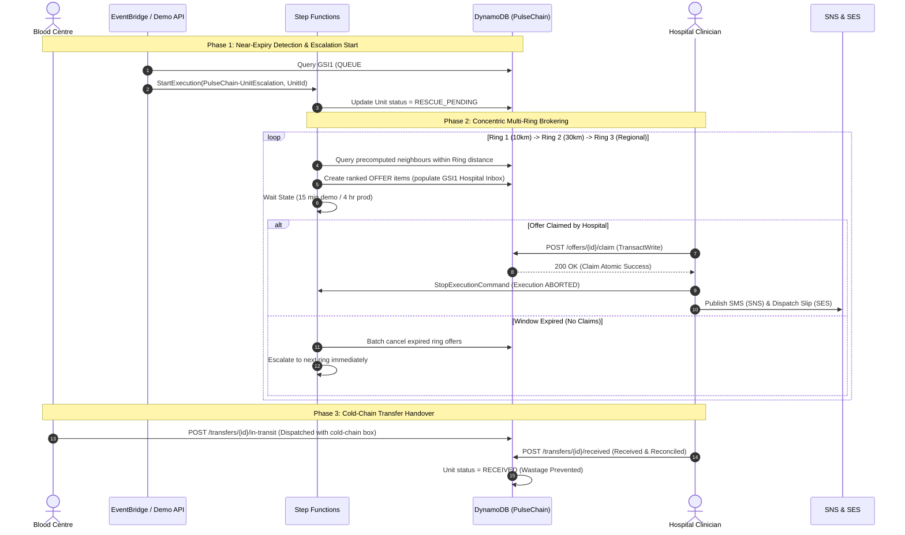

# PulseChain — System Architecture

## 1. Executive Summary

PulseChain is a zero-idle-cost, real-time emergency blood and platelet rescue orchestration network built exclusively on AWS serverless infrastructure.

In India, an estimated 11–13% of banked platelets expire before transfusion due to their narrow 5-day viability window and lack of regional coordination. PulseChain monitors facility inventories, detects units approaching expiry thresholds (e.g., within 48 hours for platelets), and automatically orchestrates concentric multi-ring rescue offers across licensed blood centres and hospitals before units spoil.

```
                  ┌─────────────────────────────────────────────────────────┐
                  │                 AWS Free-Tier Serverless                │
                  └─────────────────────────────────────────────────────────┘
                                               │
   [EventBridge Scheduler]                     │
        │ (Scheduled Sweep)                    ▼
        ▼                              [Amplify Hosting]
   [Lambda: SweepWorker]                       │ (SPA Frontend)
        │                                      ▼
        ▼                              [API Gateway HTTP]
 [Step Functions: UnitEscalation]              │ (JWT Authorizer)
   ├── MatchRing (Lambda) ─────────┐           ▼
   ├── CreateOffers (Lambda) ──────┤   [Lambda: REST API]
   ├── Wait (15m demo / 4h prod)   │     (Units, Offers, Transfers,
   ├── CheckOffers (Lambda) ───────┤      Escalations, Dashboard)
   └── FinishEscalation (Lambda)   │           │
                                   ▼           ▼
                           [DynamoDB: PulseChain]
                            (Single-Table Design)
                             GSI1: Inboxes & Queues
                             GSI2: Expiry-Sorted Stock
                                   │           │
                                   ▼           ▼
                              [Amazon SNS] [Amazon SES]
                              (SMS Alert)  (Dispatch Slip)
```

---

## 2. Service Inventory (Restricted Free-Tier Footprint)

PulseChain strictly enforces a minimal, audited service footprint designed to operate within the AWS Free Tier with a live $5 budget cap:

| AWS Service | Architecture Role | Cost & Resource Model |
| :--- | :--- | :--- |
| **Amplify Hosting** | Global static SPA hosting for React / Vite frontend | Free tier static asset hosting & CDN edge caching |
| **Amazon Cognito** | Real User Pool authentication, JWT issuance & role-based claims | Free tier (up to 50,000 MAUs) |
| **API Gateway** | HTTP API with Cognito JWT authorizer and CORS integration | Pay-per-call, low latency |
| **AWS Lambda** | TypeScript microservices (arm64, Node.js 20.x, 256MB memory) | Free tier (1M free requests / 3.2M sec compute) |
| **Amazon DynamoDB** | Single-table database (`PulseChain`) with on-demand capacity | Free tier (25 RCU/WCU, 25GB storage) |
| **AWS Step Functions** | Standard state machine orchestrating concentric ring escalation | Free tier (4,000 free state transitions / month) |
| **EventBridge Scheduler** | Cron trigger invoking scheduled inventory sweeps | Free tier (14M invocations / month) |
| **Amazon SNS** | Urgent SMS notifications dispatched to clinical duty desks | Free tier (100 SMS / month) |
| **Amazon SES** | Email delivery for cold-chain transfer manifests and audit slips | Sandbox mode / Free tier (62,000 emails / month) |
| **Amazon S3** | CloudFormation deployment templates & SAM CLI artifact storage | Standard S3 storage |

> [!IMPORTANT]
> **No Amazon Bedrock or third-party AI models exist in this architecture.** Multilingual requisition parsing, compatibility validation, and proximity scoring are 100% deterministic and execute in-process within Lambda.

---

## 3. The Three Foundational Cost Decisions

Every architectural choice in PulseChain was evaluated under the constraint of zero idle cost, predictable latency, and extreme reliability during power or connectivity interruptions:

### 1. Scheduled Sweep vs. Continuous Polling
- **Alternative:** Background polling Daemons or WebSocket streams continuously scanning stock tables.
- **Decision:** EventBridge Scheduler invokes the lightweight `SweepWorker` Lambda periodically (daily in production, on-demand `POST /demo/sweep-now` during demonstrations).
- **Cost Impact:** **$0 idle compute**. When inventory is calm, zero Lambda invocations occur and database consumption is zero.

### 2. Precomputed Distance Matrix vs. Geospatial Managed Services
- **Alternative:** Invoking Amazon Location Service or external Google Maps Distance Matrix APIs on every offer calculation.
- **Decision:** All inter-facility road distances are precomputed via Haversine projection with Coimbatore terrain factors and persisted directly in DynamoDB under the origin facility partition (`PK = FACILITY#<id>, SK = DIST#<km>#<toFacilityId>`).
- **Cost Impact:** **$0 per distance query**. Distance lookups are single-digit millisecond range queries (`BETWEEN DIST#000.0 AND DIST#010.0~`) on the existing table, eliminating external network dependencies and API fees.

### 3. Deterministic Parsing & Matching vs. Managed LLM Models
- **Alternative:** Amazon Bedrock Claude 3 Haiku for parsing unstructured chat requisitions and selecting matching units.
- **Decision:** Multi-token deterministic regex engine supporting English, Tamil (தமிழ்), and Hindi (हिन्दी) coupled with a precompiled 8x8 blood component compatibility matrix.
- **Cost Impact:** **$0 inference cost, <1ms execution latency, and zero hallucination risk**. Clinical triage rules cannot fail non-deterministically; blood typing is an exact biological science, not a probabilistic guess.

---

## 4. End-to-End Event Flow



---

## 5. DynamoDB Single-Table Schema Design

The single DynamoDB table `PulseChain` uses overloaded partition and sort keys to serve all queries with zero table scans:

### Primary Table Partition Keys
- **Facility Profile**: `PK = FACILITY#<id>`, `SK = METADATA`
- **Distance Matrix**: `PK = FACILITY#<id>`, `SK = DIST#<km:05.1f>#<toFacilityId>`
- **Blood Unit**: `PK = UNIT#<id>`, `SK = METADATA`
- **Offer**: `PK = OFFER#<id>`, `SK = METADATA`
- **Transfer**: `PK = TRANSFER#<unitId>`, `SK = METADATA`
- **Requisition**: `PK = REQUISITION#<id>`, `SK = METADATA`
- **Audit Ledger**: `PK = AUDIT#<unitId>`, `SK = TIMESTAMP#<iso>`

### Global Secondary Indexes
- **`GSI1` (Queues & Facility Inboxes)**:
  - `GSI1PK = QUEUE#AVAILABLE#<component>`, `GSI1SK = <expiresAt>` (Sorted expiry queue for sweeps)
  - `GSI1PK = FACILITY#<id>#OFFERS`, `GSI1SK = <score:0.3f>#<claimBy>` (Hospital inbox sorted by match score)
- **`GSI2` (Stock Console Inventory)**:
  - `GSI2PK = FACILITY#<id>#STOCK`, `GSI2SK = <expiresAt>#<unitId>` (Blood centre stock console sorted ascending by soonest expiry)

---

## 6. Security & Clinical Boundary Architecture

1. **Authentication & Authorization**:
   - AWS Cognito User Pool with explicit user groups: `BloodCentreStaff`, `HospitalClinicians`, `RegionalCoordinators`.
   - API Gateway verifies Cognito ID tokens and injects claims into Lambda authorizer context.
   - Cross-facility access controls: Blood centres cannot modify external stocks; hospitals cannot claim offers addressed to peer facilities.
2. **Clinical Boundary Statement**:
   - PulseChain is an **administrative coordination and rescue brokering system**, not a diagnostic or clinical release device.
   - Pre-transfusion testing, blood grouping, cross-matching, donor screening, blood component storage, and clinical transport validation remain the sole legal and medical responsibility of the licensed blood centre and receiving transfusion facility.
